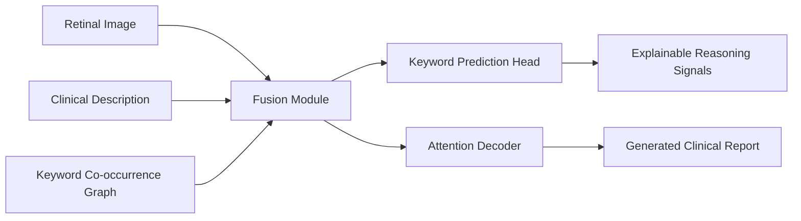

# DeepEyeReasoner

A modular, GitHub-friendly implementation of an explainable multimodal report-generation pipeline for the DeepEyeNet retinal dataset.

This repository is a practical adaptation of the methodology implied by the paper `Explainable Multimodal Chest X-Ray Report Generation with PrimeKG Guided Reasoning`, but retargeted to ophthalmology and the DeepEyeNet schema you described.

## What is implemented

- A multimodal model that fuses retinal images, clinical-description text, and a keyword knowledge graph.
- A knowledge-guided reasoning block using keyword co-occurrence graph propagation.
- Multi-task learning:
  - report generation from `report_text`
  - keyword prediction from `Keywords`
- Explainability hooks:
  - attention traces over image/text/graph fusion states
  - keyword graph visualization
  - saved prediction samples for case-by-case audit
- Comprehensive evaluation and charting utilities.

## Why these design choices

1. The paper title signals three core ideas: multimodality, explainability, and knowledge-guided reasoning.
2. DeepEyeNet provides retinal images plus structured metadata (`Keywords`, `clinical-description`, `report_text`), so the repository maps naturally to those three ideas.
3. Because the dataset is small, the implementation uses a compact, reproducible PyTorch architecture instead of a very large language model. That keeps Colab training realistic.
4. The original paper appears chest-X-ray and PrimeKG-specific, while DeepEyeNet is retinal. So the repository uses a retinal keyword graph derived from the dataset itself. This preserves the paper's knowledge-guided reasoning spirit while avoiding unsupported assumptions about missing ophthalmic KG resources.
5. The keyword-prediction auxiliary task is included because it improves factual grounding and gives directly measurable clinical labels.

## Repository layout

```text
src/deepeyenet/
  data/
  evaluation/
  models/
  training/
  utils/
scripts/
tests/
```

## Methodology mapping



## Evaluation suite

The repository computes both generation and clinical-label metrics.

Generation metrics:
- `BLEU-1`, `BLEU-2`, `BLEU-4`
- `ROUGE-L`
- token-overlap precision, recall, F1

Multi-label keyword metrics:
- micro precision, recall, F1
- macro precision, recall, F1
- mAP
- macro AUROC when defined

Recommended analysis outputs:
- split-size chart
- top-keyword bar chart
- report-length histogram
- training and validation curves
- knowledge-graph network plot
- prediction diagnostics scatter plot
- evaluation radar chart

## Colab workflow

1. Put this repo on GitHub.
2. In Colab, mount Google Drive.
3. Clone the repo.
4. Install requirements.
5. Point the scripts to your Drive folder containing:
   - `DeepEyeNet_train.json`
   - `DeepEyeNet_valid.json`
   - `DeepEyeNet_test.json`
   - `eyenet0420/...` image folders

Example Colab cells:

```python
from google.colab import drive
drive.mount('/content/drive')
```

```bash
git clone <YOUR_GITHUB_REPO_URL>
cd <YOUR_REPO_NAME>
pip install -r requirements.txt
pip install -e .
```

```bash
python scripts/prepare_data.py   --metadata-dir /content/drive/MyDrive/DeepEyeNet   --images-root /content/drive/MyDrive/DeepEyeNet

python scripts/train.py   --metadata-dir /content/drive/MyDrive/DeepEyeNet   --images-root /content/drive/MyDrive/DeepEyeNet   --output-dir /content/drive/MyDrive/DeepEyeNet_runs/baseline_run   --epochs 25   --batch-size 8

python scripts/evaluate.py   --run-dir /content/drive/MyDrive/DeepEyeNet_runs/baseline_run   --split test
```

## Reproducibility notes

- Training uses only the train split for vocabulary and graph construction.
- Validation is used for model selection.
- Test evaluation is held out until the final checkpoint is selected.
- All run artifacts are saved under the run directory:
  - config
  - vocabularies
  - keyword index
  - training history
  - best checkpoint
  - prediction dumps
  - figures

## Important assumptions

- I could not reliably extract the full PDF text from the local paper file in this workspace, so this implementation is an informed adaptation based on the paper title and the dataset structure you provided.
- If you want, the next iteration can tighten the implementation to the exact paper sections once we extract or inspect the PDF text more directly.
